<div align="center">


# inspeximus

*"We have inspected" — the medieval charter that recites an earlier one word for word and
attests it unaltered. The self-correcting memory layer for AI agents.*

*Correct a fact once and it stays corrected: inspeximus serves the new value and refuses to let the old one creep
back — deterministically, with no LLM on the write path. Extracted from an autonomous research OS that has run
it daily over 10,000 notes.*

`pip install inspeximus` → `import inspeximus` · [PyPI](https://pypi.org/project/inspeximus/) · [Hugging Face](https://huggingface.co/Danchi17/inspeximus) · [DOI](https://doi.org/10.5281/zenodo.21128549) · [Homepage](https://dancenitra.github.io/inspeximus/) · MIT · v1.41.0

[](https://github.com/DanceNitra/inspeximus/actions/workflows/audit.yml)
[](https://github.com/DanceNitra/inspeximus)

*If inspeximus's saved you some time, a ⭐ would mean a lot — it's how other people find it. Thank you!*



Built by **[Rastislav Drahoš](https://github.com/DanceNitra)** — extracted from [Agora](https://github.com/DanceNitra/agora), an autonomous research OS that runs it daily.

</div>

---

## Install into Claude Code in one line

```
/plugin marketplace add DanceNitra/inspeximus
/plugin install inspeximus@inspeximus
```

That registers this repository as a plugin marketplace and installs the MCP server, which then starts
with `uvx --from "inspeximus[mcp]" inspeximus-mcp` and keeps its store in `.inspeximus/memory.json` inside the
project. Nothing to configure by hand, and nothing to install globally.

Prefer the manual route? `pip install "inspeximus[mcp]"` and point your client at `inspeximus-mcp` — the
extra matters, because the core library is deliberately zero-dependency and the MCP server is the one
piece that needs a dependency.

## What you install, and what it does that others don't

A **mem0 alternative** built the opposite way: deterministic, not an LLM extracting facts on every write — a
memory that keeps a correction corrected and can *prove* what it erased. At a glance:

| | **inspeximus** | mem0 / cognee / Zep&nbsp;·&nbsp;Graphiti |
|---|---|---|
| **Write path** | deterministic — **no LLM** | LLM extraction on every `add()` |
| **Correction (a fact changes)** | keyed supersession serves current truth; a restated stale value can't creep back (`echo_guard`); `revert()` | LLM re-extract / bitemporal invalidation |
| **Verifiable erasure** | **signed, content-free tombstone + an offline-verifiable receipt** | `delete()` — unverified |
| **Tamper-evident record-keeping** | hash-linked receipts + a signed anchor, verified offline | SOC 2 audit logs (not cryptographic) / none |
| **EU AI Act / GDPR evidence** | **`inspeximus compliance` overlay + audit bundle** | not framed |
| **Dependencies** | **zero — one file** | server / DB / vector / graph stack |
| **MCP server** | yes (one-command install) | varies |

To our knowledge the only agent-memory library that ships verifiable erasure **and** tamper-evident
record-keeping (a scan of nine products — [details](docs/AI_ACT.md); honest: Zep has a real SOC 2/HIPAA surface,
just not verifiable erasure or AI-Act framing). And it doesn't cost you recall — the [measured integrity
number](#correction-is-a-first-class-operation-measured-across-systems) below is the proof no competitor shows.

## New — the EU AI Act compliance-evidence layer for agent memory

When the AI Act's high-risk obligations start applying (**2 Aug 2026**, Annex III systems), a provider must
*produce* evidence about what its agent **remembers**: tamper-evident record-keeping (Art. 12/19), accuracy and
resistance to tampering (Art. 15), and provable erasure on request (GDPR Art. 17). Agent-memory libraries ship
none of it. inspeximus is, to our knowledge, **the only open agent-memory library that ships verifiable erasure
(with a receipt) and tamper-evident record-keeping as reusable evidence** for that memory slice — a drop-in
overlay, not a rebuild:

```bash
inspeximus compliance --out report.html     # article-labelled evidence, live counts from your store
inspeximus audit-build --out bundle.json    # hand an auditor the bundle; they verify it offline (audit-verify)
```

Evidence, not certification; the memory slice only, and the obligations bind the deployer, not the library.
→ **[docs/AI_ACT.md](docs/AI_ACT.md)**

## Every claim below is checked by a script you can run

```bash
python claims_audit.py          # downloads the published wheel from PyPI and audits THAT
```

It fetches the released artifact, prints its sha256, and runs each claim on it — never on the working
tree. The write-path claim is enforced rather than asserted: sockets are disabled for the duration, so a
write that reached for a model would fail the check instead of passing it quietly. Claims about *other*
systems are listed separately and marked untestable here; verifying those means running those systems,
so they are never counted as passing.

```
auditing : inspeximus-1.24.1-py3-none-any.whl
13 passed · 0 FAILED · 0 skipped · 5 not testable here
```

This exists because the exercise pays for itself: the first time we ran a README sentence against the
published wheel, it failed. Erasure did delete the record and scrub the bytes, but plain `forget()` left
no receipt, so the store's own `verify_writes()` reported the deletion as out-of-band — flagging a
legitimate API call as tampering. Fixed in 1.24.0, with a regression probe, and the audit now covers it.
The tightened audit then caught a second one: `forget_subject()` was writing *two* receipts per record,
one of them with the wrong reason (fixed in 1.24.3).

**On certification.** There is no certification body for an agent-memory library, and anyone claiming
otherwise is selling a logo. SOC 2 and ISO 27001 certify organisations running services; no scheme
certifies that a Python file deletes what it says it deletes. So instead:

- **`governance_audit.py`** attacks the strongest claim here — *tell it to forget everything about a
  subject and it can prove it* — across three scenarios and three repeats each: erasure through
  `derived_from` lineage, absence from the records, from recall under several phrasings, and from the
  **bytes of every file the store wrote** including sidecars; exactly one receipt carrying the caller's
  stated basis; tamper detection; survival across a reload; unrelated records intact; and an identical
  end state on every run.
- **The audit must be able to fail.** `GOV_FALSIFY=1` skips the erasure, and CI requires the run to
  report CLAIM BROKEN. A green falsification control would mean the checks measure nothing, so it is
  treated as a build failure.
- **It runs where we cannot touch it** — every push and daily, on Linux, Windows and macOS, against
  both this source and the wheel published on PyPI. The badge above is the result. If it is red,
  believe the badge and not this paragraph.

What that does **not** certify: this store, not your vector index, prompt logs or backups; the receipt
proves the *act* of deletion, never the content; and an operator holding the receipt key can forge
receipts, so anchor the chain head externally if your adversary is the operator. Those limits are in the
docstrings too, and they are the reason the word "certified" does not appear anywhere else on this page.

### Witness network — the operator-adversarial layer

"Anchor the chain head externally" has a concrete, runnable form. `anchor()` emits a signed tree head; on its
own it catches a rewrite on **one** timeline (`verify_consistency`), but a compromised host can still show a
**different** history to a different client (a split-view / fork). Independent **witnesses** that co-sign the
head close that — an honest witness refuses to co-sign a fork, so a client requiring **k-of-n** cannot be shown
a forked head that reaches threshold. This is the one operator-adversarial guarantee a free single-party
receipt structurally cannot give — it needs an independent third party — and it needs no LLM, no GPU, no graph
database.

```bash
# each independent party runs one witness (stdlib http server, zero framework):
python -m inspeximus.witness_server --port 9700 --state witnessA.json   # prints its pubkey
```
```python
from inspeximus import Inspeximus
from inspeximus.witness_pool import collect_cosignatures, http_witness, Witness

anchor = store.anchor()                                  # signed tree head of the whole history
witnesses = [http_witness("http://hostA:9700"), http_witness("http://hostB:9701"), Witness()]
out = collect_cosignatures("my-store", anchor, witnesses)
ok = Inspeximus.verify_cosigned_anchor(anchor, out["cosignatures"],
                                       witnesses=[...pubkeys...], threshold=2)["ok"]
# a forked head -> honest witnesses REFUSE (surfaced in out["refused"]) -> it never reaches threshold;
# Inspeximus.detect_split_view(...) turns two co-signed inconsistent heads into a cryptographic fork proof.
```

See `examples/07_witness_pool.py` for the full end-to-end (honest k-of-n, honest extension, a refused fork).
No competitor ships external witnessing; witnesses persist their per-store last-signed head so the refusal
survives a restart.

### Portable audit bundle — hand an auditor one file they verify offline

EU AI Act **Article 12** (record-keeping / logging, enforceable **2 Aug 2026**) and GDPR Art.17/30 ask an
operator to *produce*, on demand, a tamper-evident log of what the system recorded, what changed, and what was
erased — and to let an independent party verify it. inspeximus already computes every piece; `audit_bundle`
serialises them into **one content-free artifact** with a **standalone verifier that needs neither the live
store nor the receipt key**:

```bash
inspeximus --receipts remember "retention policy is 90 days" --key policy::retention --object 90d
inspeximus audit-build --out bundle.json        # operator exports (content-free: hashes + surrogate ids, no text)
inspeximus audit-verify bundle.json             # auditor runs this — offline, exit 0 = PASS, 1 = FAIL
```

`audit-verify` re-walks the entire write **and** erasure history from genesis, confirms every hash and
prev-link, checks the tips/counts against the signed anchor, and fails on any post-export alteration — with
nothing but the file. Pass `--witnesses <pubkeys>` to also verify external co-signatures (the operator-adversarial
check from the witness network above). It is a tamper-evident **record-keeping artifact, not a compliance
certification** — it proves the *acts* (a write with this commitment at T; a record erased at T for request R)
and their append-only integrity, never the content (a hash of PII is still PII). Full demo:
`examples/09_audit_bundle.py`.

## Why inspeximus — the one thing no other agent memory does

Every mainstream agent-memory library puts an **LLM on the write path**: it calls a model to extract, summarize,
or build a graph *every time you store something*. mem0 runs LLM fact-extraction on `add()` by default; Zep/Graphiti
runs LLM entity/edge extraction on every `add_episode()`. That one choice is why their stored state is
**non-deterministic**, costs a model call per write, and can silently drop a fact.

**inspeximus has no LLM on the write path.** Storing a fact is a deterministic, zero-cost operation — and *that* is
what makes three things possible the mainstream libraries don't offer:

> **What that costs, measured on someone else's benchmark.** On the [MemOps](https://github.com/MemTensor/MemOps)
> long-context scenarios (24 scenarios, ~50 sessions each), ingesting one scenario through mem0's default
> pipeline took **519–917 s of LLM extraction** (median 606 s, n=24); inspeximus's write path made **zero model calls**. Read the rest
> before quoting that: on the same run, answer accuracy was **statistically indistinguishable** — inspeximus 0.593,
> a naive keep-all store 0.592, mem0 0.544, with every bootstrap CI crossing zero. So the honest claim is *same
> answers, no write-time model cost*, not *better answers*. About 2% of mem0's extraction calls failed to parse
> and those memories are missing from its store, which handicaps it slightly. MemOps is published by MemTensor,
> who also make a competing system. Harness, pre-registration and the full result:
> [agora/agora_output/lab/memops](https://github.com/DanceNitra/agora/tree/main/agora_output/lab/memops).

- **Corrections that stick.** Write a new value for a key and it *supersedes* the old one; `echo_guard` blocks a
  later restatement of the retired value from resurfacing. No config, no model call. Honest scope: the guard
  engages on **keyed or extractor-derived** assertions (the shipped extractors derive the key from raw text);
  a free-text write that nothing keys is stored as an independent record and ranks on its own.
- **Revert on command.** `m.revert(key)` rolls a corrected fact back to its predecessor. Of the leading systems
  we checked — mem0, Zep/Graphiti, Letta, Cognee, Memobase, MemoryScope, LangMem, txtai — **none exposes a
  revert-to-predecessor command** (mem0's `history()` is a read-only log; Graphiti invalidates but never
  un-invalidates; Letta has no undo).
- **Deletes the value, not just the pointer.** `forget_subject` removes the value from inspeximus's records (subject
  + its `derived_from` lineage) and leaves a **content-free**, tamper-evident signed receipt — so what remains is
  a proof-of-deletion, not the data. Since **1.24.0 every deletion path leaves that receipt**, including plain
  `forget(ids=…, where=…)`; before that only `forget_subject` and `forget_pii` did, so a record removed with
  `forget()` was erased correctly but unaccounted-for, and `verify_writes()` reported it as an out-of-band
  deletion — the store flagging its own legitimate API call as tampering. Pass `request_id=` / `basis=` to
  `forget()` to bind the reason into the receipt's committed hash. Most agent-memory libraries instead *retain the deleted value* by design:
  mem0 keeps it in its SQLite history table (a full `reset()` purges it); Graphiti stamps the old edge
  `invalid_at` and keeps it. For **secure erasure at rest** (against raw-disk/backup forensics — which a plaintext
  store of ANY library, inspeximus included, does not give you) use an encrypted store + `shred()` (NIST SP 800-88
  crypto-erasure: destroy the key and every at-rest copy dies).

| | LLM on write | corrections stick | revert to predecessor | deleted value retained? |
|---|---|---|---|---|
| **inspeximus** | **no — deterministic** | ✅ supersession + echo_guard | ✅ `revert(key)` | ✅ no — value scrubbed, content-free receipt (+ `shred()` for at-rest) |
| mem0 | yes (by default) | LLM decides ADD/UPDATE | ✗ history is read-only | ✗ kept in the history table by design |
| Zep / Graphiti | yes | temporal invalidation | ✗ no un-invalidate | ✗ invalidated edge retained |
| Letta / MemGPT | yes | LLM rewrites the block | ✗ no undo | ✗ |

*(Every competitor cell was checked against that project's current source/docs — see [the integrity
benchmark](inspeximus/probes/INTEGRITY_BENCHMARK.md), which also names each system that shares an individual property.
Cryptographic deletion receipts do exist in purpose-built provenance systems like Engram and Heartwood; the claim
here is scoped to mainstream agent-memory libraries.)*

The mechanism underneath — **no LLM on the write path** — is the part a competitor can't copy without abandoning
its extraction design. That is the moat.

## And it doesn't cost you recall

Integrity would be hollow if inspeximus retrieved worse. It doesn't. On the standard **LOCOMO** benchmark (full set,
n=1536), with the built-in tuned recipe (a semantic embedder + hybrid recall + a soft speaker prefilter),
inspeximus's **retrieval-recall@25 is 0.78** (a supporting turn is retrieved) / **0.65** (all supporting turns) —
top-tier, and measured the honest way: **LLM-free and reproducible**, with no LLM judge to inflate it. Run it:
`python inspeximus/probes/retrieval_recall_locomo.py`.

*(We deliberately don't headline an LLM-judged end-to-end QA score. Those are judge-dependent and not comparable
across harnesses — mem0 reports 66.9% and Zep 71.2% under their own judges — so a cross-system "we win" claim
would need running them through this harness, which we haven't done. What we publish is our own reproducible
number.)*

**Every number in this README traces to a runnable probe in [`inspeximus/probes/`](inspeximus/probes/). Nothing is
asserted that you can't reproduce.**

## Quickstart (2 minutes)

```bash
pip install inspeximus          # zero required dependencies
```

```python
from inspeximus import Inspeximus

m = Inspeximus("memory.json")                      # persists to JSON; drop the path for pure in-memory
m.remember("The API rate limit is 1000 req/min", key="api::rate_limit")
m.recall("what is the rate limit")            # -> ["The API rate limit is 1000 req/min"]

# Correction is first-class: writing the same key supersedes the old value — no config, no LLM call.
m.remember("The API rate limit is 5000 req/min", key="api::rate_limit")
m.recall("rate limit")                        # -> ["...5000 req/min"]  (only the current value)
m.revert("api::rate_limit")                   # roll back to the predecessor, on command
m.history("api::rate_limit")                  # full audit trail, oldest to newest
```

New in **1.11.0**: ready-made write-path extractors (`regex_extractor`, deterministic; `make_llm_extractor`,
opt-in) that can derive a key from text without an explicit one, and a first-class **LangChain**
integration (`from inspeximus.integrations.langchain import InspeximusRetriever` — a retriever that never hands a
superseded fact back to your chain). `pip install "inspeximus[langchain]"`.

**Honest scope of `regex_extractor` (measured 2026-07-20, corrected from an earlier overclaim).** It keys
clean declarative statements — "My ZIP code is 94107", "Alice's email is …", "The API rate limit is 500 rps".
It does **not** reliably key natural conversational prose: measured on an external dialogue corpus (the
MemOps dataset, arXiv 2607.12893) it derived a key for 5.2% of sentences (1,037 of 19,851 across six transcripts), and — the part that matters —
it does not hold a *stable* key across a real correction chain, because "my official title … **was** Junior
Data Analyst" and "**so my current title is** Data Analyst" yield different keys that never meet. On raw
chat transcripts, supersession therefore mostly does not fire and inspeximus behaves as a verbatim store.
**If you control the write, pass `key=` explicitly** — that is the path where corrections-stick, `revert`
and the erasure guarantees actually hold. (This README previously said the extractors exist "so supersession
engages over free text"; that was too strong. See CHANGELOG 1.23.1, which also fixes a real data-loss bug
found in the same measurement.)

## Give your agent this memory in 60 seconds (MCP)

Using **Claude Code**? One command registers inspeximus as your agent's memory ([uv](https://docs.astral.sh/uv/) fetches it, nothing else to install):

```bash
claude mcp add inspeximus -e INSPEXIMUS_PATH=~/.inspeximus_memory.json -- uvx --from "inspeximus[mcp]" inspeximus-mcp
```

**Claude Desktop / Cursor / any MCP client** — add to your MCP config (`claude_desktop_config.json`, `.cursor/mcp.json`, …):

```json
{
  "mcpServers": {
    "inspeximus": {
      "command": "uvx",
      "args": ["--from", "inspeximus[mcp]", "inspeximus-mcp"],
      "env": { "INSPEXIMUS_PATH": "~/.inspeximus_memory.json" }
    }
  }
}
```

Your agent now has `remember` / `recall` / `history` — and corrections that stick: when a fact is superseded,
recall serves the current value, a restated stale value can't resurrect it (`echo_guard`), and `revert` /
`route` undo a correction on an unmarked "go back". `recall` returns compact records by default (drops internal
fields; `get(id)` / `neighbors(id)` for detail on demand). [Full tool list below](#use-it-as-an-mcp-server-any-claude--cursor--agent-client).

### For coding agents: stop resurrecting an API a refactor already deleted

The single most common way memory fails inside a **coding loop**: a refactor renamed or removed a function, but
the model re-emits the old call because the old signature is still all over its context. That is keyed
supersession + an echo check — inspeximus's core competence — shaped for code, as three MCP tools:

```python
from inspeximus import Inspeximus
from inspeximus.code_guard import deprecate_symbol, symbol_status, check_code
mem = Inspeximus(path=".inspeximus/memory.json")

deprecate_symbol(mem, "db.query", "db.execute", reason="query() removed in 3.0; execute() returns a cursor")
symbol_status(mem, "db.query")          # -> {'verdict':'superseded','replacement':'db.execute', ...}
check_code(mem, generated_snippet)      # -> [{'symbol':'db.query','replacement':'db.execute','occurrences':1}, ...]
```

`check_code` scans a whole generated snippet and flags every deprecated symbol it resurrects (whole-identifier
match, most-used first; empty = clean) so the agent rewrites *before* returning code. Over MCP the same three
are `deprecate_symbol` / `symbol_status` / `check_code`. Deterministic table lookup — no LLM, no embedding
similarity guess, no new storage. Full runnable demo: `examples/08_code_guard.py`. This is the vendor-abandoned
need behind Claude Code #14227 ("don't resurrect the old API after a refactor"), served by the primitive
inspeximus already ships.

**Enforce it in CI, not just in the loop.** The same guard is a shell command that exits non-zero when a
deprecated symbol reappears — drop it into a pre-commit hook or a CI step so a human (or an agent) cannot merge
a resurrected API:

```bash
inspeximus deprecate db.query db.execute --reason "query() removed in 3.0"   # record the refactor once
inspeximus check-code src/**/*.py                                            # exits 1 with file:line on any resurrection
```
```yaml
# .pre-commit-config.yaml  (point INSPEXIMUS_PATH at a store committed to the repo, e.g. .inspeximus/memory.json)
- repo: https://github.com/<owner>/inspeximus
  rev: v1.39.0
  hooks: [{ id: inspeximus-check-code }]
```

Commit the store (`.inspeximus/memory.json`) so every clone shares the refactor history; the guard is a
deterministic token scan, so the same commit is a pass or a fail on every machine.

**Jump to:** [Correction (measured)](#correction-is-a-first-class-operation-measured-across-systems) ·
[Governance & erasure](#governance-erasure--audit) · [Org-wide erasure receipt](#org-wide-erasure-receipt-one-signed-manifest-across-every-store-you-register) · [Install](#install) ·
[MCP server](#use-it-as-an-mcp-server-any-claude--cursor--agent-client) ·
[Shell CLI](#use-it-from-the-shell-the-inspeximus-cli-1124) ·
[Framework integrations](#framework-integrations) ·
[The four operations](#the-four-operations) · [Five rules](#five-rules-it-wont-break-each-one-cost-us-to-learn) ·
[Provenance & receipts](#provenance--why-these-rules-with-receipts) · [Threat model](#threat-model--layered-defense-adversarial-memory-integrity)

## Use

The full API reference — every method, argument and return shape, with runnable examples —
lives in **[docs/API.md](docs/API.md)**. The four operations you actually need are further down this
page; everything else is there when you need it.
## Framework integrations

Adapters for LangGraph, CrewAI, LangChain, LlamaIndex, AutoGen and the rest,
with copy-paste snippets: **[docs/INTEGRATIONS.md](docs/INTEGRATIONS.md)**.

**Compliance-aware out of the box.** Every class-based adapter — LangGraph `InspeximusStore`, CrewAI
`InspeximusStorage`, LangChain `InspeximusRetriever` / `InspeximusChatMessageHistory`, LlamaIndex
`InspeximusMemoryBlock`, AutoGen `InspeximusMemory`, OpenAI-Agents `InspeximusSession`, Haystack
`InspeximusDocumentStore`, ADK `InspeximusMemoryService` — mixes in
`ComplianceMixin`, so the same object your agent writes memory to also produces the EU AI Act evidence —
`store.compliance_report()`, `store.compliance_check()`, `store.audit_bundle()`, `store.retention(...)`. Pass
`receipts=True` for the tamper-evident record-keeping chain those reports evidence. See
[docs/AI_ACT.md](docs/AI_ACT.md). (Pydantic AI is the one exception: it exposes a *function* toolset,
`inspeximus_toolset(store)`, so there is no adapter object — call the evidence operations on the store you
passed in.)
## Use it as an MCP server (any Claude / Cursor / agent client)

`inspeximus` ships an [MCP](https://modelcontextprotocol.io) stdio server so any MCP-compatible agent can
use it as long-term memory — `remember` (with a per-type decay prior), value-ranked `recall`,
`consolidate`, `consolidate_clusters`, `contradictions`, `value_by_cohort`, `forget` (verified erasure).
Correction is first-class over MCP too: `revert` / `route` undo a correction on an unmarked "go back", and the
read-path review layer `observe` / `reopened` / `resolve_reopened` (1.9.2–1.9.5) reopens a settled record for
steward review on a *corroborated* contradiction (a lone restatement stays an echo, never an auto-change).
The MCP `remember` exposes `key` (deterministic supersession) plus `object` / `reaffirm`, and the server
runs with **`echo_guard` ON by default** (0.6.11) so a corrected fact stays corrected even if the old value
is re-stated later — the failure mode a plain keyed/add-based store shows on RAMR's ECHO-RESISTANCE
(keyed-without-guard 0.00, a real add-based system 0.57, guard 1.00). Set `INSPEXIMUS_ECHO_GUARD=0` to disable.
Install and run the server straight from PyPI (the `[mcp]` extra pulls the MCP SDK; the core library stays
dependency-free):

```bash
pip install "inspeximus[mcp]"     # the library + the MCP server SDK
inspeximus-mcp                          # speaks MCP over stdio
```

Register it with any MCP client — Claude Code (`.mcp.json`), Claude Desktop
(`claude_desktop_config.json`), Cursor, Windsurf, Codex, Gemini. Zero-setup with `uvx` (installs on first run):

```json
{
  "mcpServers": {
    "inspeximus": {
      "command": "uvx",
      "args": ["--from", "inspeximus[mcp]", "inspeximus-mcp"],
      "env": { "INSPEXIMUS_PATH": "./inspeximus_memory.json" }
    }
  }
}
```

Or, after `pip install "inspeximus[mcp]"`, with the console script directly:

```json
{
  "mcpServers": {
    "inspeximus": {
      "command": "inspeximus-mcp",
      "env": { "INSPEXIMUS_PATH": "./inspeximus_memory.json" }
    }
  }
}
```

For **semantic** recall, point it at any OpenAI-compatible embeddings endpoint via
`INSPEXIMUS_EMBED_URL` / `INSPEXIMUS_EMBED_MODEL` / `INSPEXIMUS_EMBED_KEY`; with none set it uses the lexical
fallback. The agent then calls `recall(query)` before reasoning and `remember(fact)` as it learns —
its memory is value-ranked and append-only, not a recency buffer. If `INSPEXIMUS_EMBED_MODEL` contains
`nomic` (nomic-embed-text is asymmetric — see its model card; like E5's `passage:`/`query:`), inspeximus auto-applies its
required task prefixes — `search_document: ` for stored text, `search_query: ` for the query (opt out with
`INSPEXIMUS_NOMIC_PREFIX=0`). Omitting them was simply using the model wrong; with prefixes on, our own
reinforcement-controlled re-measure lands recall_any@1 at 0.397 on one LoCoMo config (n=1536, deterministic
retrieval-recall — an upper bound, not end-to-end QA; a self-comparison, not a cross-system claim; the earlier
0.19→0.29 delta was contaminated by a since-fixed recall-reinforcement confound — see the 1.15.0 CHANGELOG correction). In the library, pass a separate `Inspeximus(embed=…, embed_query=…)` for any
asymmetric embedder. If you use `persist_vectors=True`, also pass `Inspeximus(embed_id="…")` (a recipe fingerprint): when
it changes, inspeximus re-embeds the persisted vectors once so a new-space query can't silently mis-match old vectors.

**Compact recall + progressive disclosure (1.14.0).** Over MCP, `recall` returns a compact projection — `{id,
text, score, value, tags}` — dropping internal bookkeeping fields the model doesn't reason over, and `k` is
hard-capped (`INSPEXIMUS_MAX_K`, default 50), so a recall drops cheaply into the prompt. **Full text is kept by
default**; snippet truncation is **opt-in** (`snippet_chars>0`) — off by default on purpose, since truncating a
hit could cut off a corrected value past the boundary and defeat the echo-guard. Pull detail on demand: `get(id)`
returns one full record, `neighbors(id, k)` a bounded local expansion (excludes self). `recall(full=True)` returns
complete records. `token_report(query, k)` is a **deterministic, no-LLM** (~chars/4) payload-size estimate
comparing the compact projection to the full records for the **same k hits** — an apples-to-apples sizing aid, not
a whole-store comparison and not a measured token saving. None of this is novel — it's standard MCP/RAG
context-economy practice (progressive disclosure / small-to-big retrieval); inspeximus never emitted embedding vectors.

## The four operations

| op | what it does |
|---|---|
| `remember(text, tags, value, mtype, key)` | **append-only** raw capture, absolute UTC time, never edited; `mtype` ∈ {episodic, semantic, procedural} sets the **decay prior** (events fade fast, durable facts slow, rules barely). Optional `key` = a **deterministic (subject, relation) supersession key**: a new value retires every active record with the same key — *no similarity threshold, no LLM* — so recall never serves the stale value (bi-temporal: a back-filled earlier value can't overwrite the current one) |
| `recall(query, k, where=…)` | **value-ranked** retrieval: relevance × value, **decayed by the memory's per-type half-life** (access resets the clock), so important durable memories beat both merely-similar and stale ones. Optional `where` = a **metadata pre-filter** (the cheap *filter-before-you-rank* lever): field → scalar / list / operator (`$gte $lte $gt $lt $in $nin $ne $contains`), matched top-level then `meta`, ALL fields AND-ed — e.g. a hard time-range `where={"valid_from":{"$gte":t0,"$lte":t1}}` or a closed-set entity `where={"speaker":{"$in":[…]}}`. Measured to beat retriever choice on LoCoMo (`probes/locomo_metadata_prefilter.py`); it's a HARD filter, so on lossy/predicted extraction keep it loose (a wrong filter hard-deletes the answer). Reinforcement is **relevance-weighted** (a bullseye hit reinforces value more than one that squeaked into top-k, so a weak-but-frequent false positive can't go immortal); a repeatedly-recalled episodic memory **graduates** to semantic **only when corroborated** — by an earned outcome, or by **≥2 distinct *canonical* sources** (entity-resolved before counting, so sybil variants of one origin — `Wikipedia` / `wikipedia.org` / a full URL — collapse to one and can't mint durability); and a memory whose source was later contradicted is **provenance-demoted** + flagged `stale_derived` |
| `consolidate(keep)` | the **dream pass**: flag universal-matcher *hubs*, link near-duplicates, apply the **state-toggle guard** (a polarity clash supersedes, doesn't merge), supersede the low-value surplus — only *adds* a derived layer |
| `consolidate_clusters(threshold)` | **cluster-triggered** consolidation: consolidate a semantic cluster only once it's grown past `threshold` — sparse topics keep their raw episodes, dense ones don't grow unbounded |
| `contradictions()` | flag mutually-incompatible **related** memories (similarity-gated) for human review |
| `forget(ids, where)` | the one op that **truly deletes** (the rest is append-only): hard-removes the matched records *and* scrubs their ids from every survivor's links + toggle pointers + the vec/token caches, so a forgotten memory can't resurface via recall, a consolidation link, or the dream pass. For erasure / right-to-be-forgotten, poison removal, or a hard correction — measured 15/15 on a verified-forgetting severe-test |

## Where did this fact come from?

The question people actually ask a memory layer is not "can you undo it" — it's *"why do you hold this,
and who told you?"* `provenance()` answers it in one call, for one fact, in the order an auditor asks:

```python
m.provenance(key="billing-api::auth")     # or provenance(id="…") for one record
```

```
fact      billing-api::auth
  now       oauth2  [active]
  source    adr-014  (not attested)
  lineage   primary observation
  trust     claimed
  history   2 value(s), 1 retired
              api-keys  ->  retired by keyed_lww
              oauth2  ->  active
  integrity content matches; attribution matches; chain ok; unsigned the write receipt
```

Same answer from the shell (`inspeximus provenance billing-api::auth`, `--json` for the full object) and over
MCP (`provenance`). It assembles what the store already carries, rather than adding a new claim layer:

| field | what it answers | built from |
|---|---|---|
| `origin` | the declared source; the taint it **inherited transitively** through summarization, so a derived note is never mistaken for a first-hand one; whether an **origin attestation** bound it to a verified key; the acting user/agent/session | `source` + `derived_from` + `attested_key` |
| `trust` | the evidence grade — `claimed` → `corroborated` → `verified` → `settled`, earned from corroboration and external ratifications and **never settable by the writer** | `grade()` |
| `timeline` | every value the fact has held, its validity interval, and **which policy retired each one** (`keyed_lww`, `echo_guard`, `state_toggle`, …) | `history()` |
| `integrity` | whether the record still matches the write receipt committed at write time — so a later **relabel of its source is loud, not silent** — plus the current anchor to pin the answer against | `verify_attribution()` + `anchor()` |

**What it does not prove**, returned in a `limits` field so a caller rendering this cannot quietly drop it:
this is tamper-**evident**, not **correct** — a source that was already wrong when it was written is
committed faithfully and nothing here can tell. And unsigned (the default), the receipt chain only catches
an editor who cannot *also* rewrite the `.receipts` sidecar; pass `receipt_key=`, or have `anchor()`
witnessed externally, for the loud property to hold against someone who owns the store.

## Five rules it won't break (each one cost us to learn)

1. **Raw capture is immutable.** Consolidation adds links and markers; it never overwrites the
   source. This is what stops the slow accuracy drift of LLM-rewritten memory.
2. **Absolute timestamps at write time.** Relative/derived times rot the moment they're consolidated.
3. **Value-ranked, type-aware decay.** Retention is `value × a per-type half-life`, not recency or
   access-frequency alone. A *uniform* access-reset clock keeps merely-*popular* memories while a
   load-bearing-but-cold fact — queried once a month, prevents a destructive action — starves; we
   measured exactly that failure. The fix is that the half-life is set by **kind**, not by read
   count: episodic events fade in days, semantic facts in months, procedural rules barely at all. A
   cold-but-critical fact survives by being **typed** semantic/procedural (long half-life × its high
   value), not by frequent reads; access only resets the clock *within* a type's window.
4. **Value is reported at the cohort level** (tag / time-block), never per-memory.
5. **Contradictions are flagged, never auto-resolved.** Silent rewrites destroy trust in the whole
   memory.

## Provenance — why these rules, with receipts

<details>
<summary>Why these rules — the measured receipts behind inspeximus's design. Click to expand.</summary>

`inspeximus`'s design isn't taste; it's what Agora's lab *measured*:

- **Semantic recall beats keyword recall, and the gap widens with scale** — as the store grows to
  a corpus of several thousand notes, lexical `recall@5` decays from **0.94** (small store) to **0.25**,
  while semantic **holds at ~0.65** — ≈**2.6×** at full scale (Agora Lab `b4c260`); on paraphrase
  queries semantic `recall@5` is **0.86 vs 0.20** lexical (`3501f1`). The embedder is the real lever
  at scale; the lexical overlap match is the zero-dependency *floor* that still runs anywhere on a
  small store. (Honest footnote: pruning
  universal-matcher *hub* notes lifts **lexical** recall ~20% only when a store is link-spammed, and
  does **not** move semantic recall — it's a lexical/hybrid optimisation, not a headline.)
- **Value-ranked consolidation** — under a keep-budget, ranking *what to keep* by value beats
  FIFO/random, and the advantage **scales super-linearly as the budget shrinks** (≈1.8× at half
  budget → ≈4× at one-eighth), surviving heavy estimation noise.
- **Retention must blend value with recency, not decay on access alone** — we simulated a
  half-life-with-access-reset policy (a *popularity* signal) against a value-aware blend under a
  shrinking budget, with value made deliberately anti-correlated with access-frequency for a
  load-bearing-but-cold subset. At a 30% keep-budget the access-decay policy retained only **2.8%**
  of the high-value/low-frequency memories and **20%** of total value, vs **100%** and **64%** for
  the blend — about **3× more value kept** (the gap persists, ≈2.2× retained value, even at a 7%
  budget). Pure access-frequency decay starves the rarely-queried-but-critical memories; forgetting
  must consume an explicit value channel *separate from* access recency. (Agora Lab `19d802`.)
- **Supersession needs a deterministic key, not embedding similarity** — replicating an external
  result (MemStrata / Yadav, arXiv 2606.26511) on our own local `nomic` stack: a cosine-similarity
  classifier separating a *contradicted* fact from a *rephrased duplicate* scores **AUROC ~0.61**
  (near chance) — a contradiction is often *more* embedding-similar to the original than a true
  rephrase is. A similarity-based store therefore serves the **stale value ~42% of the time**; the
  deterministic `(subject, relation, object)` supersession key (`remember(..., key=...)`) drives that
  to **0%** (Agora Lab `exp_supersession_replication`, severe-test 8/8). This is *why* supersession is
  a key, not a threshold.
- **No single recall mechanism survives all operating points — only the layered store does** —
  head-to-head on a synthetic *evolving + contaminated* stream (stable / superseded / poisoned facts,
  local `nomic`): a naive **cosine top-1** store scores **42%** (fine on stable, but blind to
  supersession — **0/8** on updated facts — and fooled by repeated lies); a **recency** store **67%**
  (fixes supersession but serves the *freshest lie* — **0/8** on poison); `inspeximus` — deterministic
  supersession key **+** corroboration gate **+** value-ranking — is **100%**, robust across all three.
  Each single mechanism wins one regime and loses another (the *memory operating-point trap*), which is
  why the durable layer needs all three together (probe `inspeximus/probes/operating_point_memory.py`).
- **Cohort-level value** — per-memory outcome attribution is **statistically underpowered at n-of-1**
  (the best proxy reached only ~0.36 power at realistic sample sizes); the cohort is where the
  signal lives. Hence rule 4.
- **Contradiction detection** runs in production over the 10,000-note vault; the lesson that it must
  *flag, not auto-edit* (rule 5) is why silent rewrites are forbidden.

(Methods + numbers live in the Agora track record: <https://dancenitra.github.io/agora/>.)

</details>

## Threat model & layered defense (adversarial memory integrity)

<details>
<summary>The full adversarial threat model + layered defenses. Click to expand.</summary>

An untrusted-ingestion memory store cannot decide whether a written claim is *true*. inspeximus doesn't try to;
it makes the attacker **pay**, and the honest map of what each layer buys — worked to bedrock across a public
practitioner thread with adversarial review — is below. Every claim here has a runnable receipt in
[`inspeximus/probes/`](probes/); this is textbook mechanism with a receipt, **not** a new theory.

**A defense the attacker can also write is a suggestion, not a defense.** Content-declared provenance is
theater: `Source: X` and `corroborated by N` are strings a writer controls, so default (distinct source
*strings*) corroboration falls to a sybil that mints two labels (~0.9 attack-success across 10 models —
[`memory_defense_layer_probe`](probes/memory_defense_layer_probe.py)). Only channels the writer does **not**
control hold — distinct *verified keys* (`strict_corroboration`, Ed25519 `attest`) **whose issuance is itself
costly/rate-limited** (a free-to-mint key is just another string a sybil spends), an *earned* Beta(good,bad)
outcome credit a session can't self-grant, and *system write-history*.
That is Biba integrity (1977) / Cheng-Friedman (2005): no symmetric reputation is sybilproof; the escape is
an exogenous, un-writable anchor.

**The layers, and the exact residual each leaves:**
- **Provenance — did the call happen?** Bind standing to a *runtime* signature over the real `(tool, result)`,
  not the session's log ([`execution_receipt_gate`](probes/execution_receipt_gate_probe.py)). Closes fabricated
  logs **iff the executor is a trust domain separate from the session**; in-process tools → the key is
  session-readable → theater.
- **Veracity — is a real call's output true?** No write-time oracle (a novel fact has no priors; attestation =
  authorship, not truth). Standing is *earned at use time* from an observed outcome
  ([`veracity_outcome_grounding`](probes/veracity_outcome_grounding_probe.py)) — only helps where harm is observable.
- **The irreversible tail.** A provenance-scaled `spend_irreversible` budget makes a low-provenance memory bind an
  honest action's irreversible spend against itself ([`soft_influence_taint`](probes/soft_influence_taint_probe.py));
  a reversibility checkpoint bounds a one-shot defector. Bounds, doesn't close (Sybil relocates it per identity).
- **The sub-threshold coordinated campaign.** A temporal change-detector is evaded for free at bias `h→0`, but
  `B≈N·h` forces a growing correlated low-provenance population a **cross-sectional** detector catches
  ([`two_detector_trap`](probes/two_detector_trap_probe.py)); and randomized retrieval raises a *targeted*
  attacker's coverage from O(1) to ~Θ(fN) with no anchor
  ([`moving_target_retrieval`](probes/moving_target_retrieval_probe.py)).

**The bedrock.** Checked from ~8 directions (detection, reputation, elicitation-without-ground-truth à la Bayesian
Truth Serum, robust aggregation, moving-target), every layer we examined reduces to one of two exogenous anchors —
a bounded corruption *count* (Byzantine; sybils break it) or a shared attacker-independent *prior* (peer-prediction;
a coalition coordinating its reports breaks it). *(A synthesis over those cases, not a proof.)* You cannot separate
a large coordinated coalition from genuine consensus from internal signals alone (Cheng-Friedman +
Lamport-Shostak-Pease 1982; and no internal truth-oracle, by analogy to Tarski's undefinability). What that
leaves is not "give up" but a shape: **localize the one exogenous check at the rare high-consequence irreversible
step** (a human, a separately-provenanced feed — a channel the poison can't reach), and **don't let evidence-free
consensus drive an irreversible action** (weight it ~0; on an observable target, require an independent evidentiary
provenance, which is super-linear to forge, not N reputations). The residual is the integrity of that one minimal
anchor — a standard, bounded problem, not the intractable verify-all-memory one.

Prior art credited throughout: Biba 1977 · Douceur 2002 · Cheng-Friedman 2005 · Friedman-Resnick 2001 ·
Lamport-Shostak-Pease 1982 · Lorden 1971 / Moustakides 1986 (CUSUM delay floor) ·
Tarski (undefinability of truth, used by analogy) · Doyle 1979 (truth-maintenance) · Garcia-Molina & Salem 1987 (Sagas) ·
Prelec 2004 (Bayesian Truth Serum) · Blanchard 2017 / Yin 2018 (Byzantine-robust aggregation) ·
PoisonedRAG (Zou 2024) · MINJA (Dong, arXiv:2503.03704) · AgentPoison (Chen, arXiv:2407.12784) ·
the shilling / Sybil-detection line (Mobasher-Burke 2007, Mehta-Nejdl 2009, SybilRank/Cao 2012, Viswanath 2010).

</details>

## The `second_brain` thinking layer

An optional layer on top of the store — dialectic, contradiction
surfacing, question generation: **[docs/SECOND_BRAIN.md](docs/SECOND_BRAIN.md)**.
## Status

`v0.2` — the core, honest and runnable, **now with two MCP servers** (`mcp` for memory,
`second_brain_mcp` for the thinking layer over your notes) **and a deterministic supersession key**
(`remember(..., key=...)`) that closes the embedding *supersession blind spot*. Roadmap: pluggable
vector stores, a hosted tier. Open-core; the core stays free.

MIT-licensed · part of [Agora](https://github.com/DanceNitra/agora).

## Self-maintaining (maintain.py)
The #1 second-brain frustration is **maintenance**, not capture. `maintain.py` runs the chore people
stop doing — over a folder of Markdown notes it finds **dead `[[wikilinks]]`, orphan notes, stale
notes, near-duplicate clusters**, and a **vault health score** (`self_legibility` = % of notes in the
link graph's giant component — knowledge debt is a *percolation* collapse, so it warns *before* the
cliff). Crucially it turns findings into **actions**: for each orphan it **suggests which existing
note to link it to** (re-connecting it to the graph), and flags **archive candidates** (old +
isolated). It resolves links by filename *or* frontmatter alias, and dates notes by frontmatter
(not git-reset mtime) — both learned from dogfooding it on a real ~7,700-note vault (it rescued ~300
falsely-flagged orphans). Advisory + safe: it returns a plan and an action list; it never edits,
moves, or deletes a note. And it can **apply** the fix when you ask: `apply_suggestions` appends a
marked `## Related (auto-suggested)` block of `[[links]]` to each orphan — additive only, idempotent
(re-running replaces its own block), **dry-run by default**. `python maintain.py` runs a verified
round-trip on a synthetic vault (diagnose → suggest → apply); `maintenance_report` and `apply_links`
in `second_brain_mcp.py` expose it to any MCP agent.

<!-- MCP registry ownership proof -->
mcp-name: io.github.DanceNitra/inspeximus
